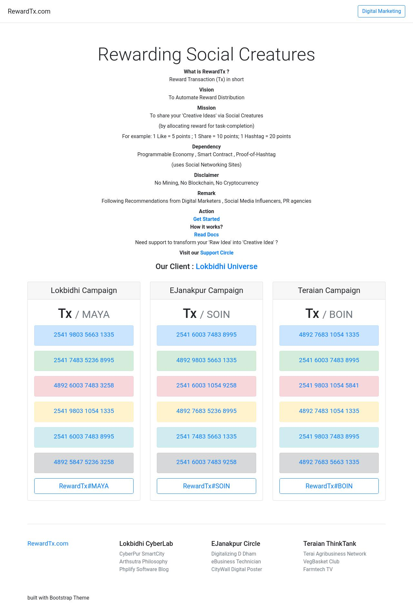

# rewardtx
RewardTx
Rewarding Social Creatures
What is RewardTx ?
Reward Transaction (Tx) in short
Vision
To Automate Reward Distribution
Mission
To share your 'Creative Ideas' via Social Creatures
(by allocating reward for task-completion)
For example: 1 Like = 5 points ; 1 Share = 10 points; 1 Hashtag = 20 points
Dependency
Programmable Economy , Smart Contract , Proof-of-Hashtag
(uses Social Networking Sites)
Disclaimer
No Mining, No Blockchain, No Cryptocurrency
Remark
Following Recommendations from Digital Marketers , Social Media Influencers, PR agencies
Action
Get Started
How it works?
Read Docs
Need support to transform your 'Raw Idea' into 'Creative Idea' ?
Visit our Support Circle
Our Client : Lokbidhi Universe
Lokbidhi Campaign
Tx / MAYA
2541 9803 5663 1335
2541 7483 5236 8995
4892 6003 7483 3258
2541 9803 1054 1335
2541 6003 7483 8995
4892 5847 5236 3258
EJanakpur Campaign
Tx / SOIN
2541 6003 7483 8995
4892 9803 5663 1335
2541 6003 1054 9258
4892 7683 5236 8995
2541 7483 5663 1335
2541 6003 7483 9258
Teraian Campaign
Tx / BOIN
4892 7683 1054 1335
2541 6003 7483 8995
2541 9803 1054 5841
4892 7483 1054 1335
2541 9803 7483 8995
4892 7683 5663 1335
RewardTx
Lokbidhi CyberLab
CyberPur SmartCity
Arthsutra Philosophy
Phplify Software Blog
EJanakpur Circle
Digitalizing D Dham
eBusiness Technician
CityWall Digital Poster
Teraian ThinkTank
Terai Agribusiness Network
VegBasket Club
Farmtech TV
built with Bootstrap Theme

